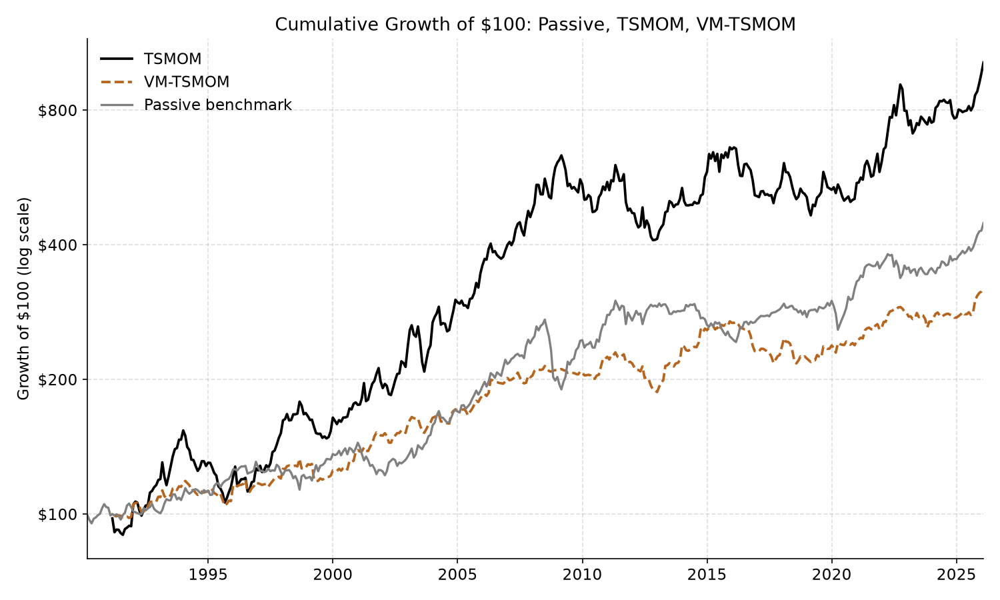
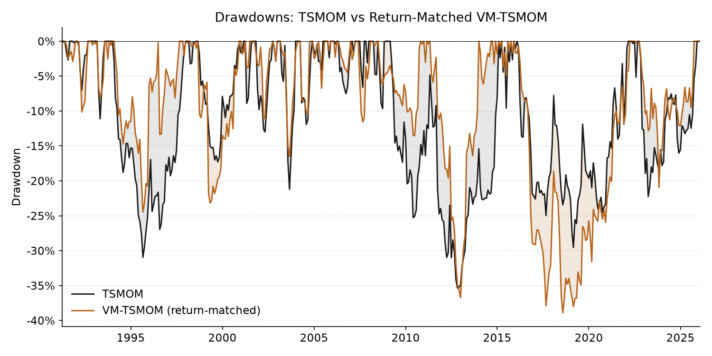
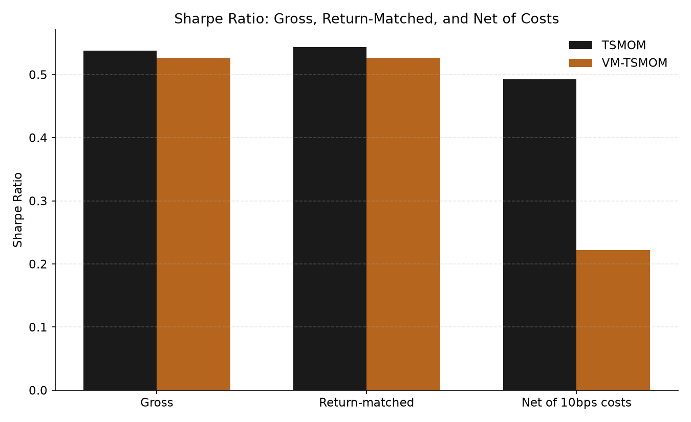
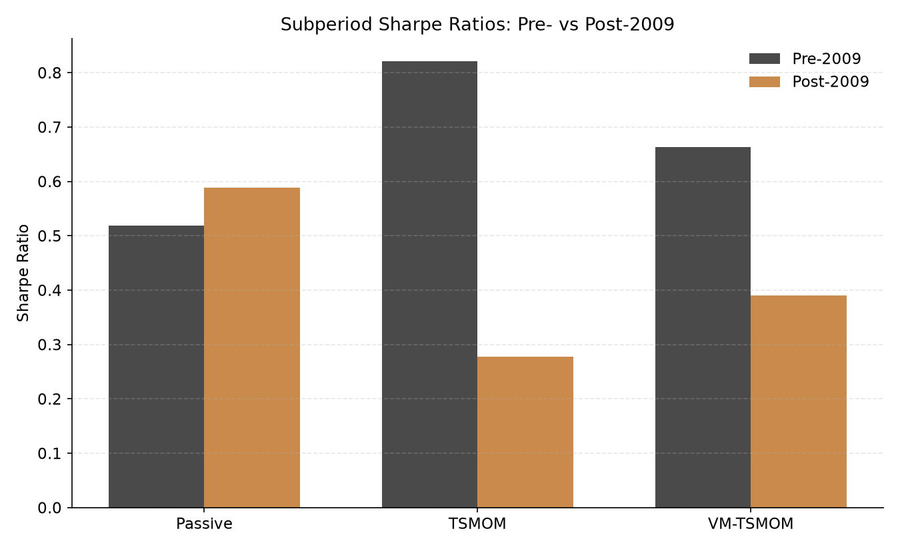

# Volatility Management as Risk Avoidance

[](https://github.com/Milansevic22/tsmom-volatility-management/actions/workflows/tests.yml)

Cross-asset time-series momentum (TSMOM) and portfolio-level volatility
management, tested on 19 futures contracts across four asset classes,
1990-2025.

This repository packages the research code behind an undergraduate
Economics and Data Science dissertation into a tested, documented
implementation. The dissertation itself (`paper/dissertation.pdf`) is the
authoritative description of the methodology and results; this repository
reproduces it in software.

## Research Question

Does portfolio-level volatility management genuinely improve cross-asset
time-series momentum, or does it mainly produce a smoother, lower-exposure
version of the same underlying strategy?

## Research Design

- **Universe:** 19 futures contracts — 8 commodities, 4 equity indices,
  3 government bonds, 4 currencies — January 1990 to December 2025
  (Bloomberg generic continuous futures, unbalanced panel).
- **Signal:** time-series momentum — the sign of each contract's trailing
  12-month return, implemented with a one-month lag.
- **TSMOM:** each contract is sized to a 40% annualised volatility target
  (ex-ante EWMA volatility, `delta = 60/61`) before equal-weight
  aggregation — the Moskowitz, Ooi and Pedersen (2012) specification.
- **VM-TSMOM:** a *separate*, signal-only equal-weight momentum portfolio
  (no per-asset volatility scaling) is scaled by the inverse of its own
  lagged monthly realised variance, calibrated to match the signal-only
  base's volatility — the Moreira and Muir (2017) specification. **This is
  not an overlay on the TSMOM series above** — see
  [Methodology](#methodology).
- **Factor regressions:** monthly excess returns on MKT (MSCI World),
  BOND (Bloomberg US Aggregate), GSCI (S&P GSCI), and Fama-French
  SMB/HML/UMD, with Newey-West HAC standard errors (12 lags).
- **Robustness:** return-matched comparison, transaction-cost sensitivity
  (5bps/10bps on turnover), pre-/post-2009 subperiods, and a circular block
  bootstrap test of Sharpe-ratio differences.

## Key Results

Gross performance (Table 3):

| Strategy | Annual return | Volatility | Sharpe | Max drawdown |
|---|---|---|---|---|
| Passive benchmark | 4.7% | 8.4% | 0.554 | -30.2% |
| TSMOM | 7.8% | 14.3% | 0.544 | -35.4% |
| VM-TSMOM | 3.6% | 6.7% | 0.527 | -19.5% |

Return-matched (VM-TSMOM rescaled to TSMOM's mean return; Table 5):

| Strategy | Annual return | Volatility | Sharpe | Max drawdown |
|---|---|---|---|---|
| TSMOM | 7.8% | 14.3% | 0.544 | -35.4% |
| VM-TSMOM (return-matched) | 7.8% | 14.7% | 0.527 | -38.9% |

Net of 10bps transaction costs (Table 7): TSMOM Sharpe 0.492, VM-TSMOM
Sharpe 0.222 — VM-TSMOM's turnover (1.715 average monthly) is nearly
three times TSMOM's (0.614).

- TSMOM outperforms the passive benchmark on absolute return but not on a
  risk-adjusted basis — the extra return is roughly proportional to the
  extra volatility taken on.
- VM-TSMOM's smoother gross return profile is largely a lower-exposure
  effect: once its returns are matched to TSMOM's, its Sharpe ratio is no
  better and its maximum drawdown is worse.
- VM-TSMOM's higher turnover makes it far more sensitive to transaction
  costs than TSMOM.
- Neither strategy produces a statistically significant factor-model alpha
  (TSMOM: 0.0024/month, p=0.344; VM-TSMOM: -0.0004/month, p=0.736).
- TSMOM's edge is concentrated pre-2009 (Sharpe 0.821); post-2009
  performance weakens materially for both strategies (TSMOM Sharpe 0.278)
  while the passive benchmark holds up.

Full numbers, including the return-matching scale factor (2.183),
turnover, and bootstrap p-values, are in `docs/validation.md`.

## Key Figures









## Methodology

A key distinction runs through the whole analysis: **cross-asset risk
normalisation** (TSMOM scaling each position by its own ex-ante
volatility, so no single market dominates the portfolio) is not the same
thing as **portfolio-level volatility management** (VM-TSMOM scaling
overall exposure by the strategy's own recent realised variance).

VM-TSMOM in this repository is built exactly as it was in the
dissertation: from a signal-only, equal-weight momentum base (no
asset-level volatility scaling), *not* as a variance-timing overlay on top
of the TSMOM portfolio described above. The two strategies therefore
differ both in how variance is managed and in how the underlying base
portfolio is constructed — a methodological choice discussed explicitly in
Sections 1, 4, and 6.3 of the dissertation, and preserved without
alteration in `src/tsmom/strategies.py`.

Other implementation details preserved from the dissertation: a $\pm$80%
return filter to exclude contract-roll artefacts, EWMA ex-ante volatility
with decay `60/61` annualised over 261 trading days, one-month
implementation lag throughout, and a circular block bootstrap
(block length $\lfloor\sqrt{T}\rfloor$) for Sharpe-ratio significance
testing.

## Repository Structure

```
paper/            The submitted dissertation (unmodified PDF).
original/         The original, unmodified research notebook (archival).
src/tsmom/        Packaged, tested implementation used by notebooks/ below.
notebooks/        Research walkthrough built on src/tsmom.
tests/            Pytest suite, run on synthetic data (no Bloomberg licence required).
figures/          Research figures referenced in this README.
data/             Data documentation only — no market data is distributed.
docs/             Validation of src/tsmom against the dissertation's reported results.
```

`original/` and `paper/` are historical artefacts, preserved exactly as
submitted. `src/`, `tests/`, `notebooks/`, and `docs/` are post-submission
software-engineering work built on top of that research — see
`original/README.md` for how the two relate.

## Reproducing the Analysis

```bash
git clone https://github.com/Milansevic22/tsmom-volatility-management.git
cd tsmom-volatility-management
pip install -e ".[dev]"
pytest
```

The test suite runs without any market data. Reproducing the actual
research results requires your own licensed Bloomberg data pull, placed
under `data/raw/` following the layout in `data/README.md` — **Bloomberg
market data used in the original study are not included in this
repository due to licensing restrictions.** The public Fama-French factors
can be fetched with `tsmom.data.download_fama_french_factors(...)`.

With data in place:

```bash
jupyter notebook notebooks/research_analysis.ipynb
```

## Validation

`src/tsmom` is checked against every headline number in the dissertation
(gross performance, return-matching, turnover, transaction costs, factor
regressions, subperiods, and bootstrap tests) in
[`docs/validation.md`](docs/validation.md). All checks pass within
Bloomberg-refresh / rounding tolerance.

## Technical Stack

Python, pandas, NumPy, statsmodels (OLS with Newey-West HAC errors), SciPy,
Matplotlib, pytest, Jupyter.

## Original Dissertation

The full submitted dissertation is at
[`paper/dissertation.pdf`](paper/dissertation.pdf). This repository adds
post-submission software engineering — a tested package, a validation
report, CI, and documentation — on top of that original academic work; it
does not change the research itself.

## Limitations

These are the limitations discussed in Section 6.3 of the dissertation,
carried over here:

- VM-TSMOM is tested as a Moreira-and-Muir-style managed-variance momentum
  strategy, not as a volatility-management overlay on the fixed TSMOM
  portfolio; a cleaner test would hold the base portfolio fixed and vary
  only the overlay.
- Returns depend on Bloomberg's continuous-futures construction (roll and
  adjustment conventions); a blanket 80% return filter is used to limit
  roll artefacts, which could also exclude genuine large moves.
- Transaction costs are a simplified basis-point-on-turnover charge, not a
  realistic model of liquidity or roll costs.
- The UMD factor is built from cross-sectional equity momentum and
  captures co-movement with TSMOM returns rather than an explanation of
  their source; trend-following payoffs are option-like, so a linear
  factor model may understate the strategies' economic value.
- The pre-/post-2009 split imposes a single break on what is likely a
  gradual regime change, and roughly halves the sample size within each
  subperiod.

## Future Research

- A cleaner test of volatility management with a fixed base portfolio and
  a varying overlay, isolating the effect of variance timing from
  differences in base-portfolio construction.
- A more realistic, asset- and liquidity-specific transaction-cost model.

## Disclaimer

Academic research only. Not investment advice.
